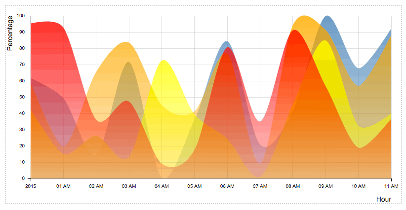

# React Easy Chart

# Introduction

This set of graphing components aims to be the easiest and fastest way of implementing a graph within a React application.

The graphs all have the following features:
- Easy to set up with only a requirement for data to render a chart
- Support realtime data feeds by reacting to data changes passed into the props automatically
- Fast rendering by using React to minimise the changes to the DOM as a result of data or props changes
- Configurable via props to allow features such as grids, width, height, axis and many more features to be added
- Responsive and Reactive graphs to fit to any device
- Interactive via mouse and click events allowing interesting applications to be built without graphing knowledge

Under the hood we use the fantastic [D3](http://d3js.org/) to create and render the charts into SVG. D3 requires some learning and will ultimately provide more flexible charts. The aim of React Easy Chart is to avoid that learning and have a common set of charts that can be set up in minutes.

We have concentrated on making an API that is consistent across a different set of graphs and so. Currently we provide a bar, line, area, scatter and pie chart.

The graphs though also support more advanced use cases such as mouseover, mousemove, mouseout, on-click events.  

##Background and Motivation
There are quite a few d3/React libraries about including probably the most sophisticated being:
- https://github.com/esbullington/react-d3/

There are also a few different techniques for implementing D3

There are some subtle differences in how rc-d3 is implemented that react-d3.
Rather than re-develop the existing excellent (D3)[https://github.com/mbostock/d3/wiki/Gallery] charts into seperate  

https://github.com/esbullington/react-d3

It is aimed at

React component implementations of Mike Bostok's D3 visualisation library.

Inspired by http://oli.me.uk/2015/09/09/d3-within-react-the-right-way/

Using:
https://github.com/Olical/react-faux-dom
